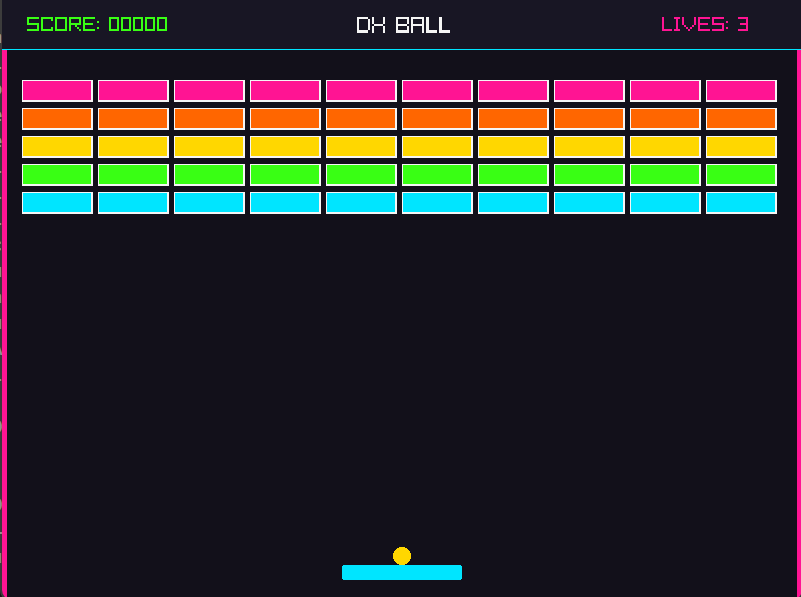

🎮 DX-Ball Game

<p align="center">
  
</p>
A classic 2D DX-Ball arcade game created using **C** and the **Raylib** library for academic evaluation.

✨ Features
🕹️ **Interactive Menu:** Main menu, level selection, and help screens.
⚡ **Difficulty Modes:** Easy and Hard modes with customized gameplay physics.
🔊 **Audio & SFX:** Background music and dynamic sound effects for impacts.
🧱 **Brick Mechanics:** Score calculating system, player lives (HP), and collision tracking.

🛠️ Tech Stack & Tools
Language: C
Library: Raylib
IDE:VS Code

🚀 How to Run Locally
### Prerequisites
Make sure you have **Raylib** installed and configured with your C compiler.
### Build and Run
1. Clone the repository:
   ```bash
   git clone [https://github.com/jisanmohiuddin/Dx-Ball-Game.git](https://github.com/jisanmohiuddin/Dx-Ball-Game.git)
2. Open the project folder in VS Code.
3. Compile and run main.c (Press F5 or use your workspace build task).
   
